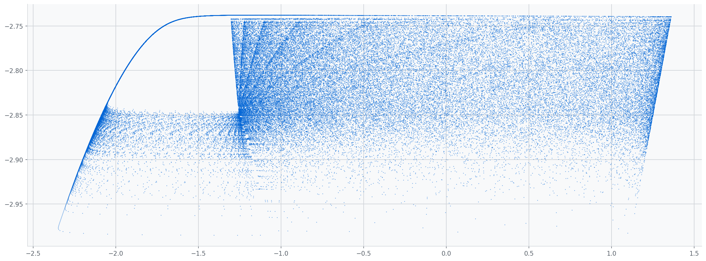

# Stochastica

Stochastica is a SuperCollider suite of chaotic and dynamic UGens for raw discrete maps, continuous dynamical systems, stochastic and event processes, triggered probability distributions, state processes, correlated noise, and explicit map sonification.

It is an experimental adaptation rather than a legacy-class replacement: no existing BhobChaos, BhobNoise, ChaosUGens, MCLDChaos, NoiseRing, Gendy, Brownian, Gaussian, or demand-rate source is modified.

## Design

- A raw map updates recurrence state only on a rising trigger.
- A flow integrates differential equations at the UGen calculation rate.
- A distribution sampler produces an independent value on a rising trigger.
- A stochastic process carries random state through time.
- An event process emits one-sample or one-control-block events.
- A sonifier explicitly folds and maps raw-map state into audio.

Seeded classes use a local PCG32 generator. An explicit nonzero seed produces the same algorithmic sequence across supported platforms; zero derives a seed from the parent Synth generator. Reset restores the original local seed.

## Classes

### Raw maps

- `HenonMap` outputs both coordinates of the Hénon recurrence. It samples parameters on trigger edges, holds between events, and resets rather than conditioning divergent state.
- `GbmanMap` outputs the Gingerbreadman map's two raw coordinates. Its recurrence is shared with the explicit `GbmanSonify` wrapper.
- `LatoocarfianMap` exposes one documented two-sine Latoocarfian recurrence. No interpolation, normalization, or frequency mapping occurs inside the raw map.
- `IkedaMap` implements the two-dimensional Ikeda map. Parameters remain unclipped and non-finite results restore the requested initial state.
- `LoziMap` implements the piecewise-linear Lozi recurrence. It holds raw state between rising trigger edges.
- `TinkerbellMap` emits both coordinates of the Tinkerbell polynomial map. Old-state values are used consistently for both next coordinates.
- `CliffordMap` implements Clifford's trigonometric attractor equations. Output is mathematical state rather than normalized audio.
- `DeJongMap` implements Peter de Jong's two-dimensional trigonometric recurrence. It is trigger driven and exposes both coordinates.
- `CircleMap` implements the normalized standard circle map. Wrapping to `[0, 1)` is part of the map definition.
- `CoupledLogisticMap` implements two symmetrically coupled logistic maps. It deliberately leaves states outside `[0, 1]` visible.
- `CoupledMapLattice` runs 2–64 periodically coupled logistic cells. Two RT-allocated arrays are swapped after each trigger-driven update.
- `RulkovMap` implements the two-state discrete Rulkov neuron model. It can expose quiescent, spiking, or bursting trajectories.

### Continuous systems

- `MackeyGlass` integrates the Mackey–Glass delay equation. It uses an RT-allocated circular history, cubic delay reads, and a fixed Heun step.
- `Chua` outputs all three states of Chua's circuit equations. It uses fixed-substep RK4 integration without output normalization.
- `Izhikevich` outputs membrane potential, recovery state, and a one-calculation spike trigger. It uses the canonical two-half-step voltage update.

### Stochastic and event processes

- `OUProcess` implements the exact finite-step Ornstein–Uhlenbeck transition and its Brownian limit. Control rate uses the full control duration.
- `RenewalTrig` schedules exponential, gamma, Weibull, lognormal, or Erlang intervals. It emits at most one event per calculation and carries timing remainder.
- `HawkesTrig` implements a bounded self-exciting point process. Its second output is the pre-event intensity used for the probability.
- `FractionalNoise` approximates finite-band `1/f^alpha` noise with normalized logarithmically spaced OU components. Quality selects 4–32 components.
- `FBrownianMotion` is a control-rate finite-memory ARFIMA-style fractional Brownian approximation. It filters normalized Gaussian innovations.
- `BoundedWalk` provides reflect, wrap, clip, bounded-resample, and absorb rules with uniform, normal, or Cauchy increments.

### Triggered distributions

- `TGammaRand` uses bounded Marsaglia–Tsang gamma sampling. Shape below one uses the standard shape-boost transform.
- `TWeibullRand` uses an open-uniform inverse transform. Shape and scale retain their conventional meanings.
- `TLogNormalRand` exponentiates a normal draw and converts overflow to the largest finite float. Sigma is interpreted by magnitude.
- `TCauchyRand` uses the tangent inverse transform. Extreme finite values are expected because no finite mean or variance exists.
- `TPoissonRand` uses bounded Knuth sampling for small means and PTRS rejection for large means. Output is an integer represented as float.
- `TGeometricRand` returns failures before the first success. Endpoint probabilities have explicit finite fallbacks.
- `TNegBinomialRand` uses a gamma–Poisson mixture and supports positive real success counts. It returns failures before the requested successes.
- `TTruncNormalRand` uses normal-CDF and inverse-CDF sampling. It samples the conditioned distribution instead of clipping a normal draw.
- `TStableRand` uses Chambers–Mallows–Stuck sampling in Nolan's S0 parameterization. Gaussian and Cauchy special cases are documented.
- `TLevyRand` uses the inverse-square normal construction with a bounded retry loop. It has one-sided support and an expected heavy tail.

### State and multivariate processes

- `MarkovChain` samples a live row-major transition-weight buffer and optionally maps states through a value buffer. User buffers are never rewritten.
- `SemiMarkov` combines the same matrix with per-state fixed, exponential, gamma, Weibull, or lognormal dwell times. It reports change and remaining time.
- `MultiGaussNoise` factors a covariance buffer at construction, reset, or reload. Failed Cholesky attempts use bounded diagonal jitter and a diagonal fallback.

### Explicit sonifiers

- `HenonSonify`, `GbmanSonify`, and `LatoocarfianSonify` map selected coordinates to iteration frequency and level. Folding ranges, selection, frequency bounds, and hold/linear/cubic-Hermite interpolation are explicit.

### Visualization utility

- `SDPhaseView` is a language-side bounded phase-portrait window for two-output state UGens. It visualizes and sonifies one shared server state, transports coordinates only at display rate, and performs all storage and drawing outside the audio thread.

## Building

```bash
cmake -S . -B build \
  -DSC_PATH=/path/to/supercollider-source \
  -DCMAKE_BUILD_TYPE=Release \
  -DSTRICT=ON
cmake --build build --config Release
cmake --install build --config Release
```

Install the staged `Stochastica` folder in the SuperCollider user extension directory and recompile the class library. For supernova, configure with `-DSUPERNOVA=ON`.

## Buffer formats

- `CoupledMapLattice`: at least `numCells` samples.
- `MarkovChain`: one-channel, row-major `numStates * numStates` transition weights; optional one-channel values.
- `SemiMarkov`: the same matrix plus a three-channel duration buffer containing mean seconds, shape, and distribution code.
- `MultiGaussNoise`: one-channel, row-major covariance matrix; optional one-channel mean vector.

Buffer examples use a `Routine` and `s.sync` before Synth creation.

## Current limits

- Fractional generators are finite-band or finite-memory approximations.
- `FBrownianMotion` is control rate only.
- Lattice size is limited to 64, Markov states to 256, Gaussian dimension to 32, and fractional quality to 32.
- `MackeyGlass.maxDelaySeconds` is allocated at construction and bounded to 60 seconds.
- Changing buffer dimensions requires recreating the Synth.
- Heavy-tailed outputs may need explicit user-side limiting before audio use.

## License

This project is distributed under GPL-2.0-or-later for compatibility with SuperCollider's server-plugin interface.
